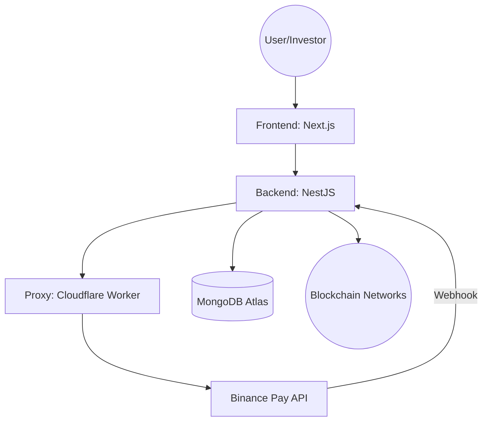
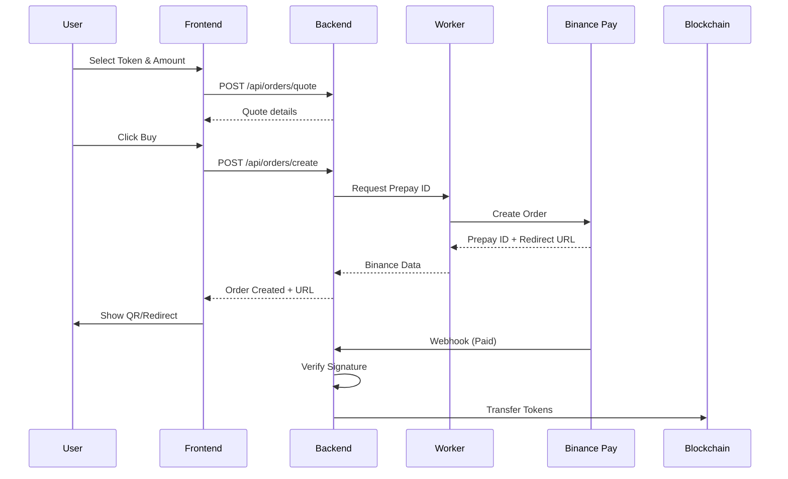
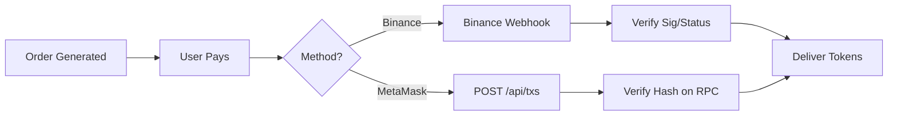

# TECHNICAL DOCUMENTATION: ICO Token Sale System 🌐

> **Single Source of Truth (SSoT) for Project Architecture and Implementation.**
> Version: 1.0.0 | Status: Production Ready | Lead: Ultra Senior Software Engineer

---

## 📋 Table of Contents
1. [Architecture Overview](#1-architecture-overview)
2. [Service Inventory](#2-service-inventory)
3. [Key File Structure](#3-key-file-structure)
4. [Functional Specifications](#4-functional-specifications)
5. [Service Communication](#5-service-communication)
6. [Environment Configuration](#6-environment-configuration)
7. [Deployment & CI/CD](#7-deployment--cicd)
8. [Security & Compliance](#8-security--compliance)
9. [Troubleshooting Guide](#9-troubleshooting-guide)
10. [Annexes](#10-annexes)

---

## 1. Architecture Overview

### High-Level Architecture
The system follows a classic 3-tier architecture with an additional serverless proxy layer for external payment integrations.



### Data Flow Diagram (Binance Pay)


---

## 2. Service Inventory

| Aspect | Detail |
|---------|-------------------|
| **Deploy Platforms** | Vercel (Frontend), Heroku (Backend), Cloudflare (Worker) |
| **Production URLs** | `ordenexchange.link` (FE), `vetawallet-1a2e38ac52b1.herokuapp.com` (BE) |
| **Regions** | us-east-1 (Heroku/Vercel), Global Edge (Cloudflare) |
| **Secrets Management** | Heroku Config Vars, Cloudflare Secrets, Vercel Env Variables |

### Critical Environment Variables
- `MONGODB_URI`: Primary database connection string.
- `JWT_SECRET`: Used for authenticating internal user sessions.
- `BINANCE_WORKER_URL`: Endpoint for Cloudflare proxy.
- `INTERNAL_API_KEY`: Security header for Backend <-> Worker communication.
- `PRIVATE_KEY`: Delivery wallet for blockchain tokens.

---

## 3. Key File Structure

### Frontend (AUKA-ICO)
```text
AUKA-ICO/
├── components/
│   ├── ui/                # Base UI components (shadcn-like)
│   └── features/          # Hero, NavBar, SideBar
├── context/
│   └── state.js           # Global State & Web3 Providers ⭐
├── pages/
│   ├── index.tsx          # Main Trading Interface ⭐
│   └── api/               # Next.js Serverless Routes
├── lib/
│   └── binance.js         # Integration helpers
└── styles/                # Global CSS / Tailwind
```

### Backend (ico-back)
```text
ico-back/src/
├── app.module.ts          # Root Module
├── main.ts                # App Entry Point
├── auth/                  # JWT & Local Logic
├── users/                 # Profile & Identity
├── orders/                # Buy/Sell Order Mgmt ⭐
│   ├── controllers/       # Quote & Create Order
│   ├── services/          # Binance Pay & Business Logic
│   └── entities/          # MongoDB Schemas
├── tables/
│   └── txs/               # Transaction logging & verification
└── blockchain/            # Web3/Ethers.js integration
```

---

## 4. Functional Specifications

### 4.1. User Authentication (JWT + Web3 Signature)
- **Technical Flow**:
  1. User enters Email/Pass (FE) → `POST /auth/login` (BE).
  2. BE verifies against MongoDB via `bcrypt` → Returns JWT.
  3. For Web3: FE requests signature (MetaMask) → BE verifies via `ethers.utils.verifyMessage`.
- **API**: `POST /auth/login` | Request: `{email, password}` | Response: `{token}`.
- **Security**: JWT expires in 24h; Password hashing via salt (rounds: 10).

### 4.2. Price Quotation Engine
- **Technical Flow**:
  1. FE calls `POST /api/orders/quote` with `tokenAmount` & `paymentCurrency`.
  2. BE fetches price from internal registry (e.g., `ORIGEN_PRICE_USDT`).
  3. If BNB: Uses `BNB_PRICE_USDT` environment var for conversion.
  4. Returns `paymentAmount` and `exchangeRate`.
- **API**: `POST /api/orders/quote` | Response: `{paymentAmount, exchangeRate, currency}`.

### 4.3. Order Creation & Payment (Binance Pay)
- **Technical Flow**:
  1. `POST /api/orders/create` (BE) → Creates `PENDING` order in DB.
  2. BE calls Worker → Worker signs request for Binance API.
  3. BP returns `prepayId` and `checkoutUrl`.
  4. FE displays QR code or redirects the user.
- **Persistence**: Order ID saved in `localStorage` for session recovery.

### 4.4. Payment Confirmation (Webhook)
- **Technical Flow**:
  1. BP sends Webhook to `/api/binance/webhook` (BE).
  2. Handler verifies signature using `BINANCE_PAY_WEBHOOK_SECRET`.
  3. Order status updated to `PAID`.
- **Handling**: Fault-tolerant retry logic from Binance side.

### 4.5. Automated Token Delivery
- **Technical Flow**:
  1. Status changes to `PAID` → Triggers `BlockchainService`.
  2. BE executes `transfer` on Orden Global (or BSC) using `PRIVATE_KEY`.
  3. Transaction Hash recorded → Status updated to `TOKENS_SENT`.
- **Security**: Idempotency checks to prevent double-spending.

---

## 5. Service Communication

- **Frontend <-> Backend**: RESTful API over HTTPS (JSON).
- **Backend <-> Worker**: Secure HTTP call with `x-api-key` header.
- **Worker <-> Binance**: Signed Request using `binance-pay-v3`.
- **Backend <-> Blockchain**: JSON-RPC over HTTPS (Ethers.js).

---

## 6. Environment Configuration

| Variable | Staging | Production | Purpose |
|----------|---------|------------|---------|
| `BINANCE_API_URL` | Sandbox | Production | API Host |
| `MONGODB_URI` | Dev Cluster | Prod Cluster | Persistence |
| `SKIP_WEBHOOK_VERIFICATION` | `true` | `false` | Security Toggle |

---

## 7. Deployment & CI/CD

### Pipeline Strategy
- **Build**: Automated tests on PR (GitHub Actions).
- **Staging**: Automatic deploy to Heroku Staging on merge to `develop`.
- **Production**: Manual promotion from Staging to Production after QA verification.
- **Rollback**: One-click rollback via Heroku Dashboard or `heroku rollbacks:rollback`.

---

## 8. Security & Compliance

- **Webhook Verification**: Signature-based validation using `BINANCE_PAY_WEBHOOK_SECRET`.
- **CORS Management**: Restricted origins in `main.ts` to `ordenglobal.link` and trusted domains.
- **Auditing**: Every blockchain delivery is logged in the `txes` collection.

---

## 9. Troubleshooting Guide

- **Error: 401 Unauthorized**: Check `INTERNAL_API_KEY` match between Backend and Worker.
- **Error: Token Delivery Failure**: Check delivery wallet balance or `PRIVATE_KEY` validity.
- **Webhook Not Reaching BE**: Verify Heroku domain is correct in Worker's `wrangler.toml`.

---

## 10. Annexes

### Glossary
- **SSoT**: Single Source of Truth.
- **Prepay ID**: Unique identifier from Binance Pay to initiate a session.
- **Idempotency**: Ensuring the same operation (like token delivery) doesn't execute twice.

### Mermaid Diagram: Full Verification Flow


---

